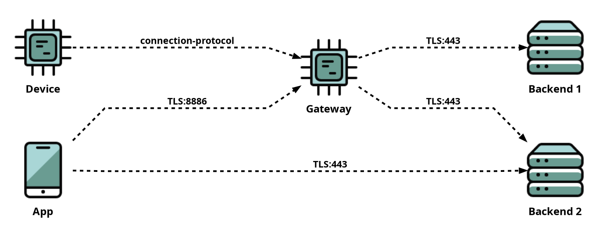

# Creating Security Statements

[Table of contents](README.md)

This document provides guidance on structuring your security statement project and details how you write the statement using our Python DSL.

## Project Structure
Security statements for each product should be placed in their own directory in a Python project. Each project is recommended to be version controlled as a _Git_-repository.
One repository can contain one or several products, each in its own directory.
Below is the expected structure for a security statement project:
```
repository-name
├── .venv
└── product-name
    ├── __init__.py
    └── statement.py
```
Above, `repository-name` refers to a repository in GitHub. Inside this repository is a folder or folders named after products, which contain the actual statement file (`statement.py`). The `.venv` folder is the Python virtual environment for the project, into which Toolsaf is installed with the _pip_-tool.

Note that security statements should not be placed inside the Toolsaf directory.

We use the _venv_ virtual environment, but any Python tooling should work fine.
The presence or absence of the `.venv` directory depends on your Python tooling,
Toolsaf does not expect it.

## Minimal Security Statement Sample

A minimal security statement by Python DSL can be structured as follows:

```python
"""Device-backend sample security statement"""
from toolsaf.main import Builder, TLS

# System root and its name
system = Builder.new(__doc__)

# Define IoT device(s)
device = system.device()

# Define backend servers(s)
backend = system.backend()

# Define connection(s)
device >> backend / TLS


# Run the system builder
if __name__ == '__main__':
    system.run()
```
This statement is available in the Toolsaf sample file as `samples/device-backend/statement.py`.
You can use the above statement as a starting point for your own security statement.
For a recap on how to start working with Toolsaf, check out
[Getting Started with Toolsaf](../README.md#getting-started-with-toolsaf).

Once you have the security statement copied or pasted into your own directory, you can
run it using Toolsaf. Assuming that you copied the contents into the file `device/statement.py`,
the following command line runs the security statement Python code.

```shell
cd <your-statement-directory>
python device-backend/statement.py
```

The output should be similar to this:

```
====================================================================================================
Verdict:         System:
----------------------------------------------------------------------------------------------------
[Incon]          Device-backend sample security statement
====================================================================================================
Verdict:         Hosts and Services:
----------------------------------------------------------------------------------------------------
[Expected]       Device
[Expected]       └──Device SW [Component]
[Expected]       Backend
[Expected]       ├──TLS:443
[Expected]       └──Backend SW [Component]
====================================================================================================
Connections
Verdict:         Source:                          Target:
----------------------------------------------------------------------------------------------------
[Expected]       Device                           Backend TLS:443
```
As you see, Toolsaf prints the structure of the security statement into terminal, we go through
the output in detail later.
The printout would contain security statement verification output if you provide tool data,
[this is explained later](VerifyingSecurityStatements.md).

Below you can see a visual illustration of the sample security statement.
It is generated with the following command line `python device-backend/statement.py -S`.


This sample security statement describes a very simple system made up of
a device and backend. The device connects to the backend using the TLS protocol.
Real systems are more complex than this. Below we go through a more practical example.

## Expanded Sample Security Statement

The following gives a more realistic, but still imaginary, security statement.

```python
"""Device-backend-mobile sample security statement"""
from toolsaf.main import Builder, TLS, DHCP, DNS, Proprietary

# System root and its name
system = Builder.new(__doc__)

# Define IoT device(s) and gateway
device = system.device()
gateway = system.device("Gateway")

# Define backend servers(s)
backend_1 = system.backend().dns("be1.example.com")
backend_2 = system.backend().dns("be2.example.com")

# Define mobile app
app = system.mobile("App")

# Define connection(s)
device >> gateway / Proprietary("connection-protocol")  # protocol not supported by framework, yet
gateway >> backend_1 / TLS
gateway >> backend_2 / TLS
app >> backend_2 / TLS
app >> gateway / TLS(port=8886)

# Some services by environment
env = system.any()
gateway >> env / DHCP / DNS


# Run the system builder
if __name__ == '__main__':
    system.run()
```

The security statement is available in the samples directory as `samples/device-backend-mobile/statement.py`.
Below you can see the generated visualization.




Since our DSL is built with Python, creating security statements is similar to writing Python scripts.
Let's go through the basic DSL concepts in the next sections.

## System Hosts, Services, and Connections

As shown in the above examples, a security statement starts with a call to the method `Builder.new()`. This call takes the system's name as an argument and returns a _system_ object, which represents the entire IoT system including devices, backend services, mobile applications, and networks.

Once the system object is created, you can begin defining the various network _hosts_ (sometimes called components or nodes). These hosts may include any of the following:

| Factory method       | Description |
|----------------------|-------------|
| `system.device()`    | IoT devices, gateways, and others _things_ |
| `system.mobile()`    | Mobile applications |
| `system.browser()`   | Users's web browser |
| `system.backend()`   | Backend services |
| `system.network()`   | System networks |
| `system.any()`       | Services provided by anyone from environment, e.g. network router |
| `system.broadcast()` | Network broadcast addresses |


Each host can be assigned a name. It's best to name them according to what they represent. For instance, if the system includes a smart plug, it should be added to the system like this:
```python
smart_plug = system.device("Smart Plug")
```

Nodes representing _backend_ services often specify the protocols they serve and DNS name for connecting to them. Here's an example:
```python
code_repository = system.backend("Code Repository").serve(HTTP, TLS).dns("github.com")
```

The code above creates a system backend named "Code Repository" that provides HTTP and TLS protocol services, and has the DNS name _github.com_.
Services are not limited to backend hosts, all host types can have services.

Connections between system components are defined using the right shift operators `>>` followed by host and service. For example, the statement `mobile >> backend / TLS` means that a mobile application initiates a connection with a backend TLS service.

Additional protocols can be added to the statement by appending the statement with several `/`:s,
for example `mobile >> backend_1 / TLS / SSH`.

Connection definitions can also be shortened as follows:
```python
backend_conn = backend / TLS / SSH

device >> backend_conn
mobile >> backend_conn
```

A service which is not created explicitly by the method `serve()` is created implicitly when needed for connection, e.g. above services `TLS` and `SSH` are created even
if the backend has not explicitly defined them.

Check out the [services](Services.md) documentation for more details and the list of available protocols.

## Software Bill of Materials (SBOM)

A Software Bill of Materials (SBOM) is an inventory of the software components, libraries, dependencies, and other elements that make up the software of an (IoT) system.
Disclosing SBOMs for IoT products is gaining attention, as it allows identifying potential
vulnerabilities from products.

In Toolsaf, SBOM defines the lower-level components of a top-level _software component_ of an IoT host. One host can have one or many top-level software components. Every host is implicitly defined to have one top-level software component.

Our DSL provides a method, `sbom(components, file_path)`, to specify the SBOM for a top-level software component. Here's how it can be used:
```python
device.software().sbom(
    components=["component1", "component2", ...]
)
# OR
device.software().sbom(
    file_path="../sbom.json"
)
```
The SBOM's contents can be provided either manually using the `components` parameter or in a JSON-format standard SPDX file via the `file_path` parameter. The `components` parameter accepts a list of software component names. The minimal contents of SPDX files, referenced by `file_path`, are as follows:
```json
{
    "packages": [
        {
            "name": "component1"
        }
    ]
}
```
Toolsaf also reads the `versionInfo` fields of individual packages from the SPDX file if they are included in the file. SBOM file paths are provided relative to the statement's location. The file can be generated, for example, using an open-source SBOM generator.

## More DSL Features.

There are [more features](MoreStatementFeatures.md) in the security statement DSL. Check them out.
  - Defining online resources to verify them
  - Specifying permissions for Android applications

## Visualizing Security Statements
You can create a diagram based on a security statement with the following command
(requires [Graphviz](https://graphviz.org/download/) installation):
```shell
python <directory>/statement.py --show-diagram
```

Once the security statement is complete, it is ready for [verification](VerifyingSecurityStatements.md).

More info on the command-line arguments can be found [here](CommandLineOptions.md#create-diagram-visualization).
