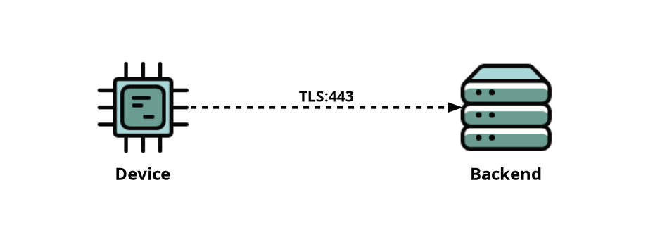

# Creating Security Statements
This document provides guidance on structuring your security statement project and details how you can fill in the statement using our Python DSL. Additionally, it outlines the various types of statements that can be created with the DSL.

## Project Structure
Security statements for each product should be placed in their own directory in a Python project. Each project is recommended to be version controlled as a _Git_-repository.
One respository can contain one or several products, each in own directory.
Below is the expected structure for a security statement project:
```
repository-name
├── .venv
└── product-name
    ├── __init__.py
    └── statement.py
```
Above, `repository-name` refers to a repository in GitHub. Inside this repository is a folder or folders named after products, which contain the actual statement file (`statement.py`). The `.venv` folder is the Python virtual environment for the project, into which Toolsaf is installed with _pip_-tool.

Note that security statements should not be placed inside the Toolsaf directory.

We use _venv_ virtual environment, but any Python tooling should work fine.
The precense or absence of `.venv` directory depends on your Python tooling,
Toolsaf does not expect it.

## Minimal security statement sample

A minimal security statement by Python DSL can be structured as follows:

```python
"""Device-backend sample security statement"""
from toolsaf.main import Builder, TLS

# System root and its name
system = Builder.new(__doc__)

# Define IoT device(s)
device = system.device()

# Define backend servers(s)
backend = system.backend()

# Define connection(s)
device >> backend / TLS


# Run the system builder
if __name__ == '__main__':
    system.run()
```
This statement is available in Toolsaf sample file as `samples/device-backend/statement.py`.
You can use the above statement as starting point of your own security statement. 
For recap how to start writing your own security statements, check out
[Getting Started with Toolsaf](../README.md#getting-started-with-toolsaf).

Once you have the security statement copied or pasted into your own directory, you can 
run it using Toolsaf. Assuming that you copied the contents into file `device/statement.py`,
the following command line runs the security statement Python code.

```shell
cd <your-statement-directory>
python device-backend/statement.py
```

The output should be similar to this:

```
====================================================================================================
Verdict:         System:
----------------------------------------------------------------------------------------------------
[Incon]          Device-backend sample security statement
====================================================================================================
Verdict:         Hosts and Services:
----------------------------------------------------------------------------------------------------
[Expected]       Device
[Expected]       └──Device SW [Component]
[Expected]       Backend
[Expected]       ├──TLS:443
[Expected]       └──Backend SW [Component]
====================================================================================================
Connections
Verdict:         Source:                          Target:
----------------------------------------------------------------------------------------------------
[Expected]       Device                           Backend TLS:443
```
Below you can see a visual illustration of the sample security statement.
It is generated with the following command line `python device-backend/statement.py -S`.



As you can see, the security statement describes a very simple system made up of
a device and backend. The device connects to the backend using TLS protocol.
Real systems are more complex than this. Below we go through more practical example.

## Expanded security statement sample

The following gives more realistic, but still imaginary, security statement.

```python
"""Device-backend-mobile sample security statement"""
from toolsaf.main import Builder, TLS, DHCP, DNS, Proprietary

# System root and its name
system = Builder.new(__doc__)

# Define IoT device(s) and gateway
device = system.device()
gateway = system.device("Gateway")

# Define backend servers(s)
backend_1 = system.backend().dns("be1.example.com")
backend_2 = system.backend().dns("be2.example.com")

# Define mobile app
app = system.mobile("App")

# Define connection(s)
device >> gateway / Proprietary("connection-protocol")  # protocol not supported by framework, yet
gateway >> backend_1 / TLS
gateway >> backend_2 / TLS
app >> backend_2 / TLS
app >> gateway / TLS(port=8886)

# Some services by environment
env = system.any()
gateway >> env / DHCP / DNS


# Run the system builder
if __name__ == '__main__':
    system.run()
```

The security statement is availabe in samples as `samples/device-backend-mobile/statement.py`. 
Below you can see the generated visualization.


## Understanding basic DSL concepts

Since our DSL is built with Python, creating security statements is similar to writing Python scripts.

As shown in the above examples, a security statement starts with a call to method `Builder.new()`. This call takes the system's name as an argument and returns a _system_ object, which represents the entire IoT system from the devices, and backend services to the mobile applications and networks.

Once the system object is created, you can begin defining the various network _hosts_ (sometimes called components or nodes). These hosts may include any of the following:

| Factory method       | Description |
|----------------------|-------------|
| `system.device()`    | IoT devices |
| `system.mobile()`    | Mobile applications |
| `system.browser()`   | Web browser |
| `system.backend()`   | Backend services |
| `system.network()`   | System networks |
| `system.any()`       | Services provided by anybody from the environment, e.g. network router |
| `system.broadcast()` | Network broadcast addresses |


Each host can be assigned a name. It's best to name them according to what they represent. For instance, if the system includes a smart plug, it should be added to the system like this:
```python
smart_plug = system.device("Smart Plug")
```

Nodes representing _backend_ services have an additional requirement. When defining them, you must specify the top-level protocols they serve and provide their DNS name. Here's an example:"
```python
code_repository = system.backend("Code Repository").serve(HTTP, TLS).dns("github.com")
```
The code above creates a system backend called 'Code Repository' that supports HTTP and TLS, with a DNS name of _github.com_. Note that adding a protocol like `TCP` to the `serve` call is only necessary if no higher-level protocol is used.

Connections between system components are defined using the right and left shift operators `>>` `<<`. The right shift operator indicates a connection from A to B. For example, the statement `mobile >> backend_1` means that the mobile application initiates a connection with backend service 1. Conversely, the left shift operator indicates a connection from B to A, so `mobile << backend_1` means that the backend service initiates communication with the mobile application.

Statements using the shift operators are typically followed by `/` and the top-level protocols used in the connection. For instance, if the mobile application connects to the backend using `TLS`, the statement becomes:
```python
mobile >> backend_1 / TLS
```
Additional protocols can be added to the statement by appending the statement with `/ <protocol>`.
```python
mobile >> backend_1 / TLS / SSH
```

Connection definitions can also be shortened as follows:
```python
backend_conn = backend / TLS / SSH

device >> backend_conn
mobile >> backend_conn
```

## Additional DSL Definitions
### Mobile Application Permissions (Android Only)
Typically mobile applications ask their users to grant them certain permissions. These permissions should be included in the security statement. You can define them with:
```python
from toolsaf.common.android import STORAGE, LOCATION, ...

mobile.set_permissions(STORAGE, LOCATION, ...)
```
However, since there are [hundreds of different permissions](https://developer.android.com/reference/android/Manifest.permission), **use the permission categories we have created** in your security statements. Toolsaf handles the rest.

Our permission categories are: `CALLS`, `SMS`, `CONTACTS`, `CALENDAR`, `LOCATION`, `RECORDING`, `STORAGE`, `NETWORK`, `HEALTH`, `ACCOUNT`, `BILLING`, `BLUETOOTH`, `ADMINISTRATIVE`, `UNCATEGORIZED`

An up-to-date list of categories can always be found [here](../toolsaf/common/android.py). You can check into which category a permission belongs to from [this json file](../toolsaf/adapters/data/android_permissions.json). Currently, if a permission is not in the _.json_ file, its category will be `UNCATEGORIZED`.

### Software Bill of Materials
A Software Bill of Materials (SBOM) is a comprehensive inventory of the software components, libraries, dependencies, and other elements that make up the software of an (IoT) system. Our DSL provides a method, `sbom(components, file_path)`, to specify an SBOM for the system's software components. Here's how it can be used:
```python
device.software().sbom(
    components=["component1", "component2", ...]
)
# OR
device.software().sbom(
    file_path="../sbom.json"
)
```
The SBOM's contents can be provided either manually using the `components` parameter or in a JSON-format SPDX file via the `file_path` parameter. The `components` parameter accepts a list of software component names. The minimal contents of SPDX files, referenced by `file_path`, are as follows:
```json
{
    "packages": [
        {
            "name": "component1"
        }
    ]
}
```
Toolsaf also reads the `versionInfo` field of individual packages if it is included in the file. SBOM file paths are provided relative to the statement's location. The file can be generated, for example, using an open-source SBOM generator.

### Online Resources
Our DSL provides the `online_resources(name, url, keywords)` method to document web-based information relevant to the system, such as privacy, security, and cookie policies. However, it can also be any web page.

Online resources can be added to the security statement using the following syntax:
```python
system.online_resource(
    name="privacy-policy",
    url="https://example.com/privacy/",
    keywords=["privacy policy", "personal data", ...]
)
```
It is recommended to name online resources descriptively, based on their purpose. For example, a link to a vulnerability policy should be named `vulnerability-policy`.

In addition to the `name` and the resource's `url`, `online_resource` also requires the user to provide a list of keywords. You can decide what keywords to add. However, they should all be found on the page. These keywords are used during verification to ensure that the page and its contents was actually accessible during the verification process.

## When the Statement is Defined
To ensure that your statement is filled in properly, run the statement file with Python. This way you can be sure that its free of runtime errors.
```shell
python3 statement.py
```
Once the security statement is complete, it is ready for [verification](VerifyingSecurityStatements.md).

## Security Statement Visualization
You can visualize your security statement with the following command:
```shell
python3 statement.py --create-diagram --show-diagram
```
More info on the command-line arguments can be found [here](CommandLineOptions.md#create-diagram-visualization).

Toolsaf creates visualizations using [Diagrams](https://github.com/mingrammer/diagrams). You also need to install [Graphviz](https://graphviz.org/download/).
