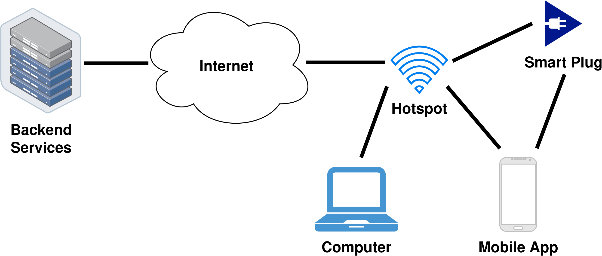

## Verifying Security Statements
Security statement verification is a two-step process. It starts with data collection using any of the [supported tools](../Tools.md#list-of-supported-tools) and ends with running the statement's Python file with the `-r` or `--read` command-line flag. This document explains this process.

### Collecting Tool Data
Data collection requires the Device Under Test (DUT) to be connected to a WiFi-hotspot from which data can be collected. The WiFi-hotspot must be able to access the system's backend services. Mobile devices running related applications should also be connected to the same hotspot as the DUT.

As an example of the data collection setup, here is an image of the system architecture from our Deltaco Smart Outdoor Plug security statement creation process.

In this setup, tools were operated by sending commands from the computer to the WiFi-hotspot over SSH. The tools we used were **_tcpdump_** and **_nmap_**.

### Notes on Collecting Different Types of Data
#### Network Traffic
When it comes to capturing network traffic with, e.g. tcpdump, start capturing packets before powering on the device or starting mobile applications. This ensures that all relevant data is captured.

### Using Tool Data with TDSAF
TDSAF verifies security statements by acomparing them to data collected from the system with any of the [supported tools](../Tools.md#list-of-supported-tools). When running a security statement file, tool output is provided to TDSAF with command-line flags `-r` and `--read`. Here's an example:
```shell
python3 product/statement.py -r ../sample-data/product/
```
In this example, we have a directory called `sample-data` which holds the data collected for the system. TDSAF also requires that `00meta.json` files are also present in the data directory. More details on these JSON files are available [here](../Tools.md#batch-files-and-directories).

### Checking TDSAF Output
Once a security statement file is run with either one of the _read_ flags, TDSAF outputs the statement's verification result. Here's an example to give you a rough idea what the results look like:
```
== System ==
== Hosts ==
DUT [Expected/Pass]
    Addresses: DUT
    DUT SW [Component]
    UDP:63144 [Expected/Pass] auth=False
    ARP: [Expected/Pass]
Mobile App [Expected/Pass]
    Addresses: Mobile_App
    Mobile App SW [Component]
    TLS: 443 [Expected/Pass] auth=True
    SSH: 22 [Unexpected/Fail]
Backend 1
    Addresses: 1.2.3.4 1.2.3.5 1.2.3.6 Backend_1 example.com
    Backend 1 SW [Component]
    TLS: 443 [Expected/Pass] auth=True
    NTP: 123 [Expected/Fail] auth=False
6.5.4.3 [Unexpected/Fail]
    Addresses: 6.5.4.3
    HTTP: 80 [Unexpected/Fail] auth=False
== Connections ==
    Mobile App  ==> DUT SSH:22 [Expected/Pass]
    DUT         ==> Backend 1 UDP:63144 [Expected]
    DUT         ==> 6.5.4.3 HTTP:80 [Unexpected/Fail]
    Mobile App  ==> play.googleapis.com TCP: 443 [External]
    ...
```
The output is divided into two main sections: _Hosts_ and _Connections_. These sections lists out all the hosts (devices, backends, etc.) and connections you have defined in the security statement, along with hosts and connections, found by TDSAF from tool output, that are not present in the statement.

#### Hosts
TDSAF displays each host's name and a status message ([Expected/Pass] or [Unexpected/Fail]). A host is marked as expected and passes verification if it is defined in the security statement. Otherwise, it's marked as unexpected, and that part of the verification result is marked as failed.

The host's address is then listed, which could include a DNS name, one or more IP addresses, or an alias from `00meta.json`. In the example above, addresses for DUT and Mobile App are listed as `DUT` and `Mobile_App`, as they were defined in `00meta.json`. Backend 1's address list includes the IP addresses TDSAF found for it from a network traffic capture. Backend 1 was also defined in `00meta.json` so its address list includes `Backend_1`, and its DNS name provided in the security statement.

Lastly, associated protocols and ports are listed. Their status can be `Expected` or `Unexpected` and `Pass` or `Fail`. This again dependes on if they were defined in the security statement and found in the tool output.

#### Connections
TDSAF lists out individual connections, displaying their source and target (`source ==> target`). This is followed by the top-level protocol and target port that were used.

Connections are categorized as `Expected`, `Unexpected` or `External`. As with hosts, a connection is `Expected` when it is listed in the security statement and `Unexpected` when it's not. An exception to this are connections from mobile devices. They can be `External` when the communication source or target is not defined in the statement. This additional status was added as mobile devices make large amounts of connections to services unrelated to the system under test.

Connection status is set to `Passed` if its definition in the security statement matches the tool output. **But sometimes it is just `Expected`, Why?**


### TODO
- Improve the TDSAF output explanation
- Mention claims