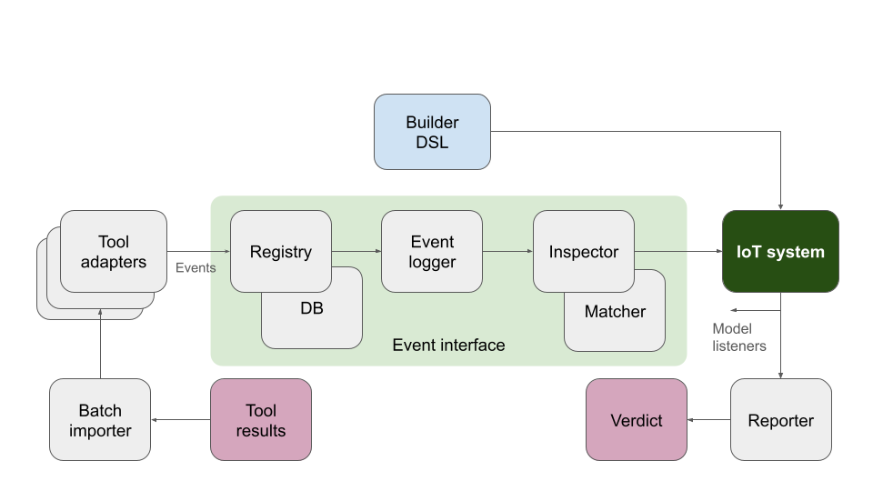

# Architecture

The following image shows the overall Toosafs software architecture.

Main components in the arhitecture diagram are the following:

 * **Builder DSL**: System builder which is configured by the DSL.
   Main classes `Builder` and `BuilderBackend`.

 * **IoT system**: The class hierarchy of the modeled IoT system.
   Main class `IoTSystem`.
   The most essential classes for model are the following:

   * **Host** stands for all hosts, its children are services.

   * **Service** represents a service in a host.

   * **NodeComponent** base class for internal host componets, such as _sofware_ component.

   * **IoTSystem** which children are the hosts.

 * **Event interface**: Pipeline of classes which implement the
   `EventInterface` class. The consume _Events_ (see [`common`](Common.md) sub-module), process them, and
   finally update the system model.

   * **Registry**: Provides long-term event storage in a DB.
     Alows user to reload stored events.
     Main class `Registry`.
     This component will be replaced or removed by something supporting uploading to cloud storage (opt-in, of couse).

    * **Event logger**: Store events and the properties they change
      so that the reason for property changes can be retrieved later.
      Mail class `EventLogger`.

    * **Inspector**: Inspect events and update the IoT system model
      accordingly. This requires matching addresses and connections into
      various system entities.
      Main classes `Inspector` and `Matcher`.

  * **Batch importer**: Read *batch files* of tool results and use
    various [**Tool adapters**](Adapters.md) which convert input into events.
    Main classes `BatchImporter` and `ToolAdapter`.

  * **Reporter**: Read the IoT system and its properties to output
    textual or graphical results with verdicts.

## Module documentation

| Sub-module                              |  Description |
|-----------------------------------------|--------------|
| [`toolsaf`](Main.md)                    | Main classes and Toolsaf entrypoint
| [`toolsaf/common`](Common.md)           | Common utilities used by all sub-modules
| [`toolsaf/core`](Core.md)               | Core classes of the Toolsaf architecture
| [`toolsaf/adapters`](Adapters.md)       | Tool adapters
