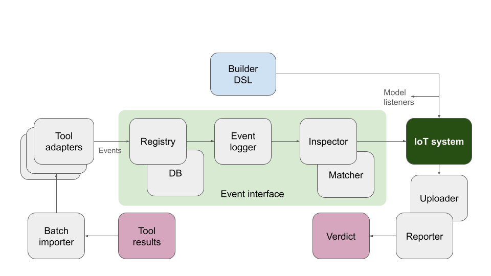

# Architecture

The following image shows the framework's overall software architecture.

Main components in the arhitecture diagram are the following:

 * **Builder DSL**: System builder which is configured by the DSL.
   Main classes `Builder` and `BuilderBackend`.

 * **IoT system**: The class hierarchy of the modeled IoT system.
   Main class `IoTSystem`.

 * **Event interface**: Pipeline of classes which implement the
   `EventInterface` class. The consume *Events*, process them, and
   finally update the system model.

   * **Registry**: Provides long-term event storage in a DB.
     Alows user to reload stored events.
     Main class `Registry`.

    * **Event logger**: Store events and the properties they change
      so that the reason for property changes can be retrieved later.
      Mail class `EventLogger`.

    * **Inspector**: Inspect events and update the IoT system model
      accordingly. This requires matching addresses and connections into
      various system entities.
      Main classes `Inspector` and `Matcher`.

  * **Batch importer**: Read *batch files* of tool results and use
    various [**Tool adapters**](Adapters.md) which convert input into events.
    Main classes `BatchImporter` and `ToolAdapter`.

  * **Reporter**: Read the IoT system and its properties to output
    textual or graphical results with verdicts.

## Contents
|   | Table of Contents |
|--:|:----------|
| 1 | [Common](Common.md) |
| 2 | [Tool Adapters](Adapters.md) |
| 3 | **FIXME** |
